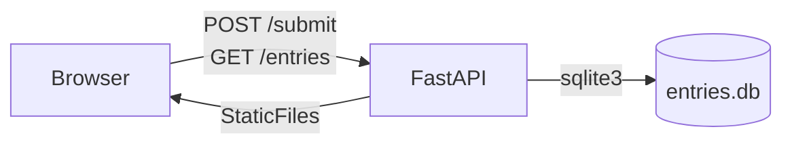

# Eggs Unlimited — Request Eggs Form

A small local FastAPI + SQLite web app for submitting and listing egg supply requests from shops.

---

## Quick Start

```bash
python -m venv .venv
source .venv/bin/activate
pip install -r requirements.txt
uvicorn app:app --reload
```

Dependencies are pinned in `requirements.txt` for reproducible installs.

---

## Endpoints

| Method | Path | Description |
|--------|------|-------------|
| `GET` | `/` | Renders the request form |
| `POST` | `/submit` | Saves one record; responds `{ "id": "<uuid>" }` |
| `GET` | `/entries` | Returns all records as JSON |
| `GET` | `/export.csv` | Downloads all records as a CSV file |
| `GET` | `/exportcsv` | Alias for `/export.csv` (same handler, both paths registered) |
| `GET` | `/healthz` | Returns `200 OK` |

---

## Architecture



---

## Form Fields & Validation

Fields marked **required** must be present in every submission. Enum values are the only accepted strings for those fields.

| Field | Required | Type / Constraints |
|-------|----------|--------------------|
| `farm_name` | **yes** | string |
| `contact` | **yes** | string |
| `phone_email` | no | string |
| `location` | **yes** | string (ZIP or city) |
| `type` | **yes** | enum: `Conventional`, `CageFree`, `FreeRange`, `Organic` |
| `size` | **yes** | enum: `Medium`, `Large`, `XLarge`, `Jumbo` |
| `grade` | **yes** | enum: `AA`, `A`, `B` |
| `pack` | **yes** | enum: `12ct_carton`, `18ct_carton`, `24ct_tray`, `30dozen_case` |
| `quantity_value` | **yes** | numeric (positive number) |
| `quantity_unit` | **yes** | string (e.g., `dozen`, `case`) |
| `price_per_dozen` | no | numeric |
| `available_start` | no | date string |
| `available_end` | no | date string |
| `notes` | no | string |

Validation is enforced at three layers: HTML5 `required` attributes (UX), Pydantic at the API boundary (types + required), and SQLite `CHECK` constraints on enum columns (defense-in-depth).

---

## Running the Tests

<!-- FILL IN PHASE 5 -->

```bash
pytest -v
```

---

## Decisions & Trade-offs

Each bullet corresponds to a conscious architectural choice. One-sentence rationale is filled in after the code exists (Phase 6).

- **§6.1 Project layout** — _TODO: one-sentence why_
- **§6.2 Pydantic model design** — _TODO: one-sentence why_
- **§6.3 Database schema** — _TODO: one-sentence why_
- **§6.4 SQLite connection lifecycle** — _TODO: one-sentence why_
- **§6.5 Validation strategy** — _TODO: one-sentence why_
- **§6.6 Frontend rendering pattern** — _TODO: one-sentence why_
- **§6.7 Endpoint URL ambiguity (`/export.csv` vs `/exportcsv`)** — _TODO: one-sentence why_
- **§6.8 CSV export implementation** — _TODO: one-sentence why_
- **§6.9 Logging** — _TODO: one-sentence why_
- **§6.10 Error UX (friendly 422 messages)** — _TODO: one-sentence why_
- **§6.11 Test scope** — _TODO: one-sentence why_
- **§6.12 README diagram** — _TODO: one-sentence why_
- **§6.13 Run command** — _TODO: one-sentence why_
- **§6.14 Repo hygiene** — _TODO: one-sentence why_

---

## What I'd Add With More Time

- Pagination on `/entries` (no filtering in scope, but the list will grow)
- CSRF protection on the form
- Structured logging (JSON lines, request-id header)
- A small Playwright end-to-end test alongside the pytest unit tests
- A `DELETE /entries/{id}` endpoint
- Postgres + connection pool if the app ever needed to handle more than one concurrent user

---

## Walkthrough Cheat Sheet

See [AGENTS.md §8](AGENTS.md#8-walkthrough-defense-cheat-sheet) for likely reviewer questions and short, defendable answers.

> Note: If `AGENTS.md` is not shipped in the final repo, inline the cheat sheet here during Phase 6.

---

<!--
BRAINSTORM — fill this in before Phase 1; delete or keep private

1. What's the one thing about this project I'm least sure I can defend in 30 seconds?
   [your answer here]

2. Which of the 14 §6 decisions feel arbitrary to me, and what would I prefer to do instead?
   [your answer here]

3. Which form field do I expect to be hardest to validate cleanly?
   [your answer here]
-->
