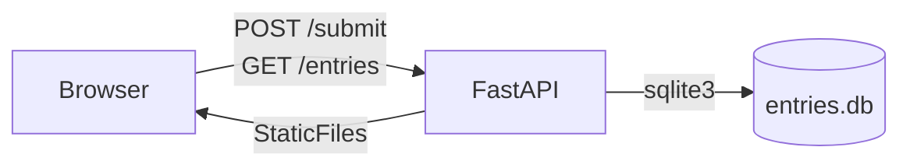

# Eggs Unlimited — Request Eggs Form

A small local FastAPI + SQLite web app for submitting and listing egg supply requests from shops.

---

## Quick Start

```bash
python -m venv .venv
source .venv/bin/activate
pip install -r requirements.txt
uvicorn app:app --reload
```

Dependencies are pinned in `requirements.txt` for reproducible installs.

---

## Endpoints

| Method | Path | Description |
|--------|------|-------------|
| `GET` | `/` | Renders the request form |
| `POST` | `/submit` | Saves one record; responds `{ "id": "<uuid>" }` |
| `GET` | `/entries` | Returns all records as JSON |
| `GET` | `/export.csv` | Downloads all records as a CSV file |
| `GET` | `/exportcsv` | Alias for `/export.csv` (same handler, both paths registered) |
| `GET` | `/healthz` | Returns `200 OK` |

---

## Architecture



---

## Form Fields & Validation

Fields marked **required** must be present in every submission. Enum values are the only accepted strings for those fields.

| Field | Required | Type / Constraints |
|-------|----------|--------------------|
| `farm_name` | **yes** | string |
| `contact` | **yes** | string |
| `phone_email` | no | string |
| `location` | **yes** | string (ZIP or city) |
| `type` | **yes** | enum: `Conventional`, `CageFree`, `FreeRange`, `Organic` |
| `size` | **yes** | enum: `Medium`, `Large`, `XLarge`, `Jumbo` |
| `grade` | **yes** | enum: `AA`, `A`, `B` |
| `pack` | **yes** | enum: `12ct_carton`, `18ct_carton`, `24ct_tray`, `30dozen_case` |
| `quantity_value` | **yes** | numeric (positive number) |
| `quantity_unit` | **yes** | string (e.g., `dozen`, `case`) |
| `price_per_dozen` | no | numeric |
| `available_start` | no | date string |
| `available_end` | no | date string |
| `notes` | no | string |

Validation is enforced at three layers: HTML5 `required` attributes (UX), Pydantic at the API boundary (types + required), and SQLite `CHECK` constraints on enum columns (defense-in-depth).

---

## Running the Tests

```bash
source .venv/bin/activate
pytest -v
```

Three tests run against isolated temp SQLite files — the production `entries.db` is never touched. See `tests/conftest.py` for how `dependency_overrides` swaps the DB connection per test.

---

## Decisions & Trade-offs

Phase 1 Choices (bootstrap):
- **Dependency management (`venv` + `requirements.txt`)**: Used standard `python -m venv` and a pinned `requirements.txt` over tools like Poetry for ease of reproducibility without extra software.
- **Health endpoint only in bootstrap**: Setup only health check endpoint for quick readiness check, smoke tests and environment verification to reduce debugging surface early.
- **`StaticFiles` mount with a placeholder `index.html`**: Set up static serving early so the frontend files have a clear place to live before building the full UI.
- **Route registration order (mount last)**: `app.mount("/", ...)` is placed after all API routes because FastAPI matches paths top-to-bottom and a root catch-all would intercept API requests if registered first.
- **Logging via default uvicorn access logs**: No custom middleware added since uvicorn already prints method, path, and status per request, which satisfies the rubric requirement with zero extra code.

Phase 2 Choices (data model + DB layer):

- **Pydantic model design (flat vs nested)**: I used a flat `EggRequest` model because the fields are simple attributes of a single record, and do not form reusuable sub-objects. Nesting would add unnecessary mapping complexity.
- **Enum-backed fields**: I used enums to centralize allowed values in named types (`EggType`, `EggSize`, etc.), which keeps validation rules explicit and avoids repeating the same validation logic in multiple places. 
- **Database schema shape**: I used one denormalized `entries` table because the scope is a single submission entity. If the domain expanded into separate reusable entities (for example shops, users, shipments), I would normalize into related tables with foreign keys.
- **Startup initialization (`lifespan`)**: I run `init_db()` in FastAPI's lifespan startup so a fresh clone creates the table automatically before serving requests.
- **SQLite connection lifecycle**: Each request opens its own SQLite connection via FastAPI `Depends(get_db)` and closes it afterward, avoiding leaked connections and a shared long-lived connection under concurrency.

Phase 3 Choices (endpoints and validation)
- **CSV route ambiguity (`/export.csv` vs `/exportcsv`)**: Register both paths on one handler to match spec wording differences.
- **Friendly validation error**: Added a customer `RequestValidationError` handler returning `{"errors":[{"field","message}]}` so frontend can map errors directly to inputs instead of FastAPI's default `detail` structure.
- **CSV generation approach**: Used `csv.DictWriter` + `io.StringIO` in-memory because dataset size is small; streaming would add complexity with little value for the scope of the assignment.
- **Entries ordering**: `Get /entries` returns newest first (`ORDER BY created_at DESC`) so recent submissions appear at top of the UI table.
- **Server-side UUID generation in `POST /submit`**: Keeps ID creation authoritative on backend and matches spec reponse `{"id": "<uuid>"}`.

Phase 4 Choices (frontend)
- **`novalidate` on the form**: Disabled browser-native HTML5 validation popups so all error feedback flows through the custom 422 inline error path, giving consistent styling on every field. The `required` attributes are still present for semantics and screen readers.
- **Empty optional fields stripped client-side**: `FormData` returns `""` for untouched inputs; stripping those keys before `JSON.stringify` lets Pydantic see them as absent (→ `None`) rather than as the empty string `""`, so required/optional distinctions work as expected.
- **Numeric coercion via `Number()`**: `FormData` returns all values as strings; `quantity_value` and `price_per_dozen` are cast with `Number()` before posting so Pydantic receives a float, not a string.
- **`loadEntries()` on page load and after submit**: The table is rebuilt from `GET /entries` on initial load and after each successful `POST /submit` so that the database is accurate.
- **Single `index.html` with inline `<script>`**: Keeps the entire frontend in one file with zero build tooling, consistent with the assignment's no-bundler constraint and easy to walk through line-by-line.

Phase 5 Choices (tests)
- **Three tests vs. the spec's "at least one"**: Each test maps directly to a rubric line — healthz (200 OK), round-trip (data sent + listable + multiple entries), 422 (friendly-error bonus). The cost is ~55 lines and proves deliberate coverage rather than a single token check.
- **`tmp_path` temp file instead of SQLite `:memory:`**: An in-memory SQLite database is per-connection. With a per-request connection model, each route handler would open a fresh empty DB and see no data. A temp file behaves identically to the production DB while staying isolated per test.
- **`dependency_overrides` to swap the DB connection**: FastAPI's documented test pattern for replacing a `Depends()` target without touching production code. Cleaner than monkey-patching `DB_PATH` because the override is scoped to the fixture and cleared automatically in `finally`.
- **`init_db` refactored to accept an optional connection**: Avoids duplicating the `CREATE TABLE` SQL between `app.py` and the test fixture. When called with no argument (startup), it opens its own connection; when called with a connection (test fixture), it uses that one. One source of truth for the schema definition.
<!-- ---

## What I'd Add With More Time

- Pagination on `/entries` (no filtering in scope, but the list will grow)
- CSRF protection on the form
- Structured logging (JSON lines, request-id header)
- A small Playwright end-to-end test alongside the pytest unit tests
- A `DELETE /entries/{id}` endpoint
- Postgres + connection pool if the app ever needed to handle more than one concurrent user

--- -->

<!-- ## Walkthrough Cheat Sheet

See [AGENTS.md §8](AGENTS.md#8-walkthrough-defense-cheat-sheet) for likely reviewer questions and short, defendable answers.

> Note: If `AGENTS.md` is not shipped in the final repo, inline the cheat sheet here during Phase 6. -->

---

<!--
BRAINSTORM — fill this in before Phase 1; delete or keep private

1. What's the one thing about this project I'm least sure I can defend in 30 seconds?
   [your answer here]

2. Which of the 14 §6 decisions feel arbitrary to me, and what would I prefer to do instead?
   [your answer here]

3. Which form field do I expect to be hardest to validate cleanly?
   [your answer here]
-->
